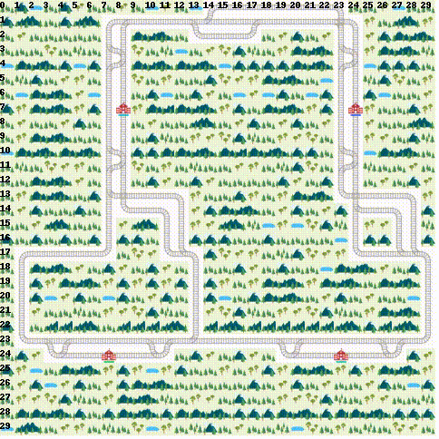
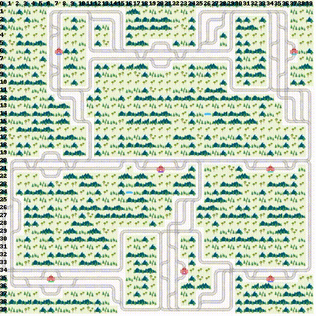
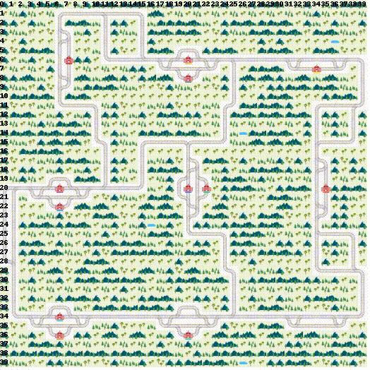
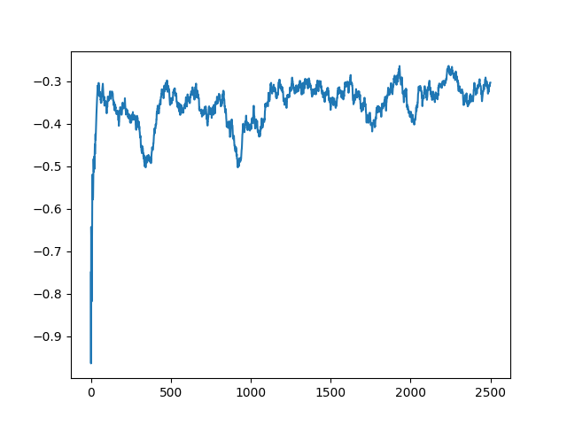
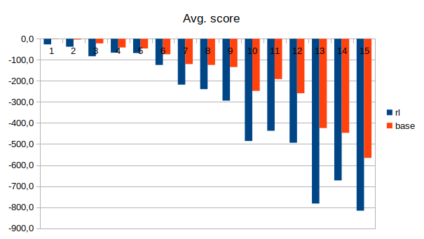
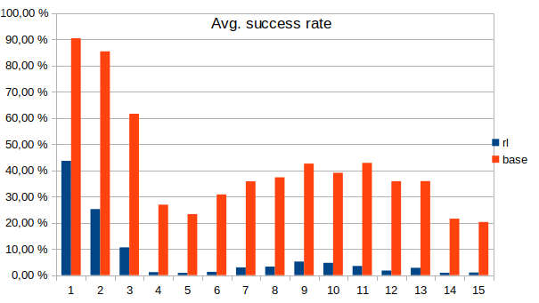

# Flatland-RL

    
      Figure 1: Flatland Environment

## 1. Introduction

This Repository contains two experimental approaches to a railway scheduling problem.
These kind of problems describe real-world problems in complex railway network, where
dense traffic needs to be managed efficiently.
In particular, deadlocks of two trains in opposite directions needs to be prevented.

The project is based on *Flatland* ([[1]](#7-references)), a multi-agent simulation environment
for railway networks, introduced in section 2. Basic Operations Research (OR) planing
method are described in section 3. These methods are the base adopted in section 4 to develop a
Reinforcement Learning (RL) approach to tackle the problem. Both approaches are evaluated and
compared in section 5. Finally, a conclusion is given in section 6.

## 2. Flatland

### 2.1 Environment

*Flatland* (https://gitlab.aicrowd.com/flatland) is an open-source multi-agent simulation environment
written in python. It provides methods, to generate complex railway networks, represented as a
cellular automat, where agents aka trains can navigate through. Each agent has access to all
information of the environment, like other agents position, speed or destination.
The code depends on the *flatland* environment and makes use of several classes from the *flatland-starter-kit*.
Modified classes can be found in */fl_base* and */rl*.

### 2.2 Actions

At each time step, an agent must choose an action from the action space. The action space contains
5 actions („Do nothing“, „Left“, „Forward“, „Right“, „Stop“).
At each time step a cell can only be occupied by one agent.
Therefore, two agents must not enter a section in opposite directions to prevent deadlocks.

## 3. Deterministic OR-planing

As a baseline, we implemented a deterministic planing approach called TreePathPlaner, which extends
the base class in TreeObservation.py. The implementation can be found in observation/TreePathPlaner.py.

The algorithm takes an RailEnv and a list of agents as input and outputs a conflict free schedule
for every agent. The schedule consists of position/action pairs for each agent for every time step.

The approach schedules the agents in sequence, ordered by a priority. The priority depends on the ratio
of the allowed travel time to the required minimum travel time. For each agent, the shortest path is computed and
tested for any conflicts with other already scheduled agents. If there is no conflict, the path is
used as is, i.e. shortest-path is taken.

If there is a conflict, two waiting strategies are investigated:
First, the agent waits in place, until no conflict occurs on the path anymore.
The second strategy is to wait in a section within the path, so that a conflicting agent can pass.

If no feasible path is found, all possible routes to the agents target are enumerated in a tree-structure
and the same two waiting strategies are applied. Note, that depending on the size of the environment
the enumeration may take several seconds up to an hour, as the number of possible paths grows exponentially.

If still no feasible schedule could be found, the agent is scheduled after all conflicting agents. Thus, the
agent will be late, i.e. will arrive after its latest arrival constraint.

 

  
  

  Figure 2: Two example environments using OR schedule. The colored symbols indicates the predicted trajectories.

## 4. Reinforcement Learning

To tackle the described problem with a reinforcement learning approach, we used a Double Duelling DQN policy
(DDDQN) ([[2], [3], [4]](#7-references)) and trained it using our custom observation.
The observation is based on our TreePathPlaner implementation from the previous section.

### 4.1 Observation/State

The observation describes the state of the environment at a given time step to the agent.
In our approach we extended the TreeObservation.py with our TreePathPlaner as predictor. In order to have
reasonable computation times during training, the tree-depth is fixed to 2, which means that the paths are
only evaluated for the next 2 decisions (in contrast to the agent target, c.f. section 3). The implementation can be
found in rl/RLObs.py.

### 4.2 Training of policy

To train the policy we started with small environments and a single agent. Later the size and the number of
agents were increased. See implementation for further details.

The learning approach does not compute an overall schedule for an agent, but gives an action in each timestep.
All required information is encoded in the observation presented to the policy. The policy then needs to
take an action from the action space. Thereby, possible deadlocks with other agent needs to be prevented
without blocking each other, i.e. both agents stops movement.

In other words, the policy needs to trade-off which agent should move and which should wait.
Balancing this trade-off proved to be critical in training, as the agents tends to either always move
or never.

Figure 1 shows an example learning curve during training. The training of the policy can be found in rl/multi_agent_training.py.

    
     Figure 3: Example loss during training.

## 5. Experiments

### 5.1 Tests

The following parameters were used, to create random, but deterministic test instances.

See ./experiments/TestParameter.py for further details.

|  Name   | #Agents | x-dim | y-dim | #Cities | #Runs |
|:-------:|:-------:|:-----:|:-----:|:-------:|:-----:|
| Test_00 |    5    |  25   |  25   |    2    |  50   |
| Test_01 |   10    |  30   |  30   |    2    |  50   |
| Test_02 |   20    |  30   |  30   |    3    |  50   |
| Test_03 |   50    |  20   |  35   |    3    |  40   |
| Test_04 |   80    |  35   |  20   |    5    |  30   |
| Test_05 |   80    |  35   |  35   |    5    |  30   |
| Test_06 |   80    |  40   |  60   |    9    |  30   |
| Test_07 |   80    |  60   |  40   |   13    |  30   |
| Test_08 |   80    |  60   |  60   |   17    |  20   |
| Test_09 |   100   |  80   |  120  |   21    |  20   |
| Test_10 |   100   |  100  |  80   |   25    |  20   |
| Test_11 |   200   |  100  |  100  |   29    |  10   |
| Test_12 |   200   |  150  |  150  |   33    |  10   |
| Test_13 |   400   |  150  |  150  |   37    |  10   |
| Test_14 |   425   |  158  |  158  |   41    |  10   |
Table 1: Test parameter

### 5.2 Results

Both approaches were evaluated on these instances.

The overall computation time for the test on i7-Intel® Core™ i7-10710U CPU x 12 :

- OR approach: about 140 hours
- RL approach: about 16 hours

The results of both approaches are summarized in the following two tables.

 

| No. | avg score | avg score/agent | avg #late | avg #late [%] | avg #success | avg #success [%] |
|:---:|:---------:|:---------------:|:---------:|:-------------:|:------------:|:----------------:|
|  0  |   -5,4    |      -1,1       |    0,5    |     9,60%     |     4,5      |      90,40%      |
|  1  |   -41,4   |      -4,1       |    1,5    |    14,60%     |     8,5      |      85,40%      |
|  2  |  -439,0   |      -22,0      |    7,7    |    38,40%     |     12,3     |      61,60%      |
|  3  |  -2081,3  |      -41,6      |   36,6    |    73,10%     |     13,5     |      26,90%      |
|  4  |  -3711,0  |      -46,4      |   61,4    |    76,71%     |     18,6     |      23,29%      |
|  5  |  -5908,6  |      -73,9      |   55,4    |    69,21%     |     24,6     |      30,79%      |
|  6  |  -9627,1  |     -120,3      |   51,4    |    64,21%     |     28,6     |      35,79%      |
|  7  |  -9949,6  |     -124,4      |   50,1    |    62,67%     |     29,9     |      37,33%      |
|  8  | -10753,1  |     -134,4      |   46,0    |    57,44%     |     34,1     |      42,56%      |
|  9  | -24763,2  |     -247,6      |   61,0    |    60,95%     |     39,1     |      39,05%      |
| 10  | -19143,7  |     -191,4      |   57,2    |    57,15%     |     42,9     |      42,85%      |
| 11  | -51783,7  |     -258,9      |   128,3   |    64,15%     |     71,7     |      35,85%      |
| 12  | -84835,8  |     -424,2      |   128,2   |    64,10%     |     71,8     |      35,90%      |
| 13  | -178774,1 |     -446,9      |   313,8   |    78,45%     |     86,2     |      21,55%      |
| 14  | -240517,9 |     -565,9      |   338,8   |    79,72%     |     86,2     |      20,28%      |
Table 2: Results of OR approach

 

| No. | avg score | avg score/agent | avg #late | avg #late [%] | avg #success | avg #success [%] |
|:---:|:---------:|:---------------:|:---------:|:-------------:|:------------:|:----------------:|
|  0  |  -134,5   |      -26,9      |   2,82    |     56,4%     |     2,18     |      43,6%       |
|  1  |  -379,6   |      -38,0      |   7,48    |     74,8%     |     2,52     |      25,2%       |
|  2  |  -1662,4  |      -83,1      |   17,88   |     89,4%     |     2,12     |      10,6%       |
|  3  |  -3310,0  |      -66,2      |   49,43   |     98,9%     |     0,58     |       1,2%       |
|  4  |  -5445,8  |      -68,1      |   79,30   |     99,1%     |     0,70     |       0,9%       |
|  5  |  -9966,0  |     -124,6      |   79,00   |     98,8%     |     1,00     |       1,3%       |
|  6  | -17440,2  |     -218,0      |   77,63   |     97,0%     |     2,37     |       3,0%       |
|  7  | -19152,4  |     -239,4      |   77,40   |     96,8%     |     2,60     |       3,3%       |
|  8  | -23516,5  |     -294,0      |   75,85   |     94,8%     |     4,15     |       5,2%       |
|  9  | -48583,5  |     -485,8      |   95,30   |     95,3%     |     4,70     |       4,7%       |
| 10  | -43716,0  |     -437,2      |   96,50   |     96,5%     |     3,50     |       3,5%       |
| 11  | -98787,7  |     -493,9      |  196,50   |     98,3%     |     3,50     |       1,8%       |
| 12  | -156541,3 |     -782,7      |  194,40   |     97,2%     |     5,60     |       2,8%       |
| 13  | -269109,0 |     -672,8      |  396,40   |     99,1%     |     3,60     |       0,9%       |
| 14  | -347068,0 |     -816,6      |  420,70   |     99,0%     |     4,30     |       1,0%       |
Table 3: Results of reinforcement approach

The score represents the loss, so zero would be optimal. Otherwise, the loss represents the distance from
the agents target. An agent is late, if its score is greater than zero. If the loss is zero, the agent is
referred to as success.

As the results show, neither approach could solve all instances. This underlines the general complexity
of the scheduling task in itself.

The sequential OR approach struggles with finding feasible paths if the number of agents increases.
As more and more agent are scheduled, the probability for conflict increases such that no more feasible paths
are possible. As a consequence, these agent will be scheduled late.

The learning approach does not compute an overall schedule for an agent, but gives an action in each timestep.

The OR approach clearly outperforms the learning approach in terms of average score and success rate,
as shown in Figure 1 and 2.

In contrast, the computation times of the learning approach were much lower (11%), compared to the OR approach.
However, the training time must also be taken into account in the learning approach.

    
     Figure 4: Comparison of the average score per agent.

 

    
     Figure 5: Comparison of the average success per agent. Success means the agent has reached his target in <time></time>

## 6. Conclusion

Manging dense traffic on complex railway networks a hard task. Flatland is great open-source
simulation environment to experiment with this kind of problem (section 2).
We investigated classical operations research in section 3 and developed a reinforcement
learning approach based on these methods in section 4.
The experiments in section 5 showed that the classical approach performs better than the
learning approach, but also that solving these kind of problems is a hard task in itself that needs further
investigation, as neither approach could solve all test instances.

## 7. References
[1] [Flatland-RL : Multi-Agent Reinforcement Learning on Trains](https://arxiv.org/abs/2012.05893) 
[2] [Playing Atari with Deep Reinforcement Learning](https://arxiv.org/abs/1312.5602) 
[3] [Deep Reinforcement Learning with Double Q-learning](https://arxiv.org/abs/1509.06461)  
[4] [Dueling Network Architectures for Deep Reinforcement Learning](https://arxiv.org/abs/1511.06581)
